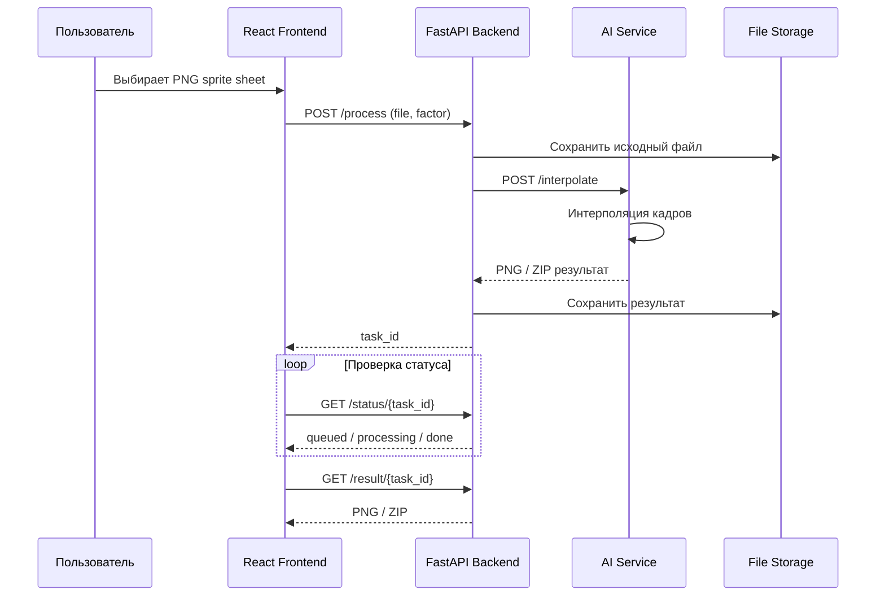

# API и последовательность обработки

## Последовательность работы MVP

```mermaid
sequenceDiagram
    participant User as Пользователь
    participant Frontend as React Frontend
    participant Backend as FastAPI Backend
    participant AI as AI Service
    participant Storage as File Storage

    User->>Frontend: Выбирает PNG sprite sheet
    Frontend->>Backend: POST /process (file, factor)

    Backend->>Storage: Сохранить исходный файл
    Backend->>AI: POST /interpolate

    AI->>AI: Интерполяция кадров
    AI-->>Backend: PNG / ZIP результат

    Backend->>Storage: Сохранить результат
    Backend-->>Frontend: task_id

    loop Проверка статуса
        Frontend->>Backend: GET /status/{task_id}
        Backend-->>Frontend: queued / processing / done
    end

    Frontend->>Backend: GET /result/{task_id}
    Backend-->>Frontend: PNG / ZIP
```

[Главная страница](api.md)